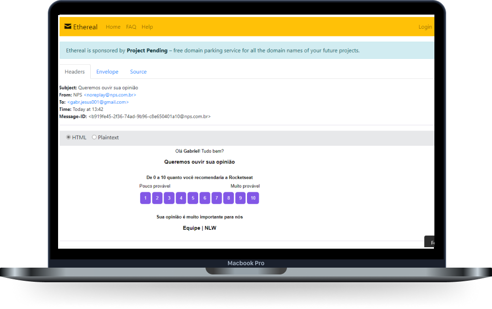

<h1 align="center">
  NLW 4 - NPS API
</h1>

    <a href="#-projeto">Projeto</a>&nbsp;&nbsp;&nbsp;|&nbsp;&nbsp;&nbsp;
    <a href="#-tecnologias">Tecnologias</a>

  

## 💻 Projeto

API criada na Next Level Week 4, com o objetivo de criar um calculo de NPS (métrica de lealdade do cliente), ao enviar um email para o usuário e após receber uma resposta, é feito um calculo para a empresa melhorar o seu serviço.

## 🚀 Tecnologias

- [Node.js](https://nodejs.org/en/)
- [Express](https://expressjs.com/)
- [Typeorm](https://typeorm.io/#/)
- [Sqlite3](https://www.sqlite.org/index.html)
- [Yup](https://github.com/jquense/yup)
- [Nodemailer](https://nodemailer.com/about/)
- [Jest](https://jestjs.io/)
- [Typescript](https://www.typescriptlang.org/)
